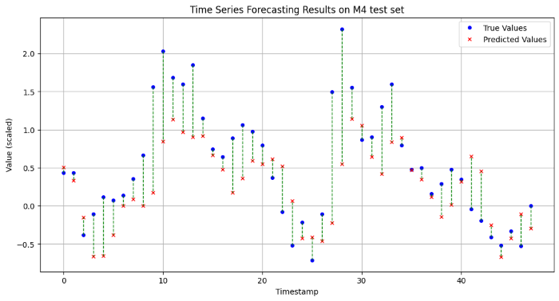

# Time Series Forecasting with Multi-Layer Perceptron (MLP)
This Python script implements a straightforward yet versatile Multi-Layer Perceptron (MLP) for time series forecasting. The model is designed to handle various time intervals, including yearly, quarterly, monthly, daily, or hourly datasets—such as those utilized in the **M4 competition**.

## Requirements
* Python 3.x
* TensorFlow
* Pandas
* NumPy
* Matplotlib
* Statsmodels
* Scikit-learn

## Usage
1. **Dataset Preparation**: Prepare your time series data in CSV format following the naming convention for different frequencies (e.g., Yearly-train.csv, Yearly-test.csv).
2. **Configuration**: Adjust parameters like frequency, offset, and max_epochs within the script based on your dataset and requirements.
3. **Execution**: Run the script/notebook and observe the training and evaluation steps for your MLP model.

## Insights
Upon analyzing the performance of the MLP model on the M4 competition dataset, several noteworthy observations emerged. The model's predictions aligned closely with the actual values for most of the time series, as depicted in the following figure:

  

The model demonstrated commendable accuracy, particularly in capturing the overall trends and seasonal patterns within the data. However, in certain instances, deviations were observed, especially during periods of abrupt changes or irregular fluctuations. This suggests potential areas for further refinement, such as exploring more sophisticated architectures or fine-tuning hyperparameters to improve adaptability to such variations.

Feel free to explore, modify, and enhance this codebase to suit your specific use case or experiment with different datasets and configurations.

## License
This project is licensed under the MIT License - see the [LICENSE](LICENSE) file for details.
